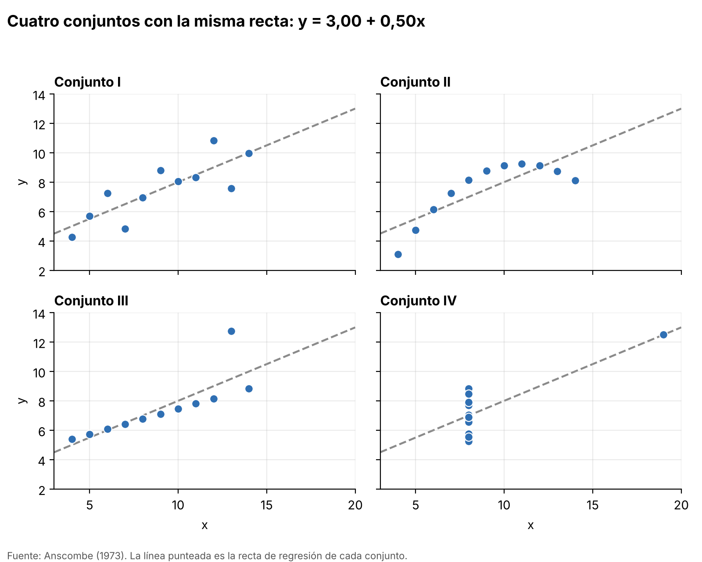
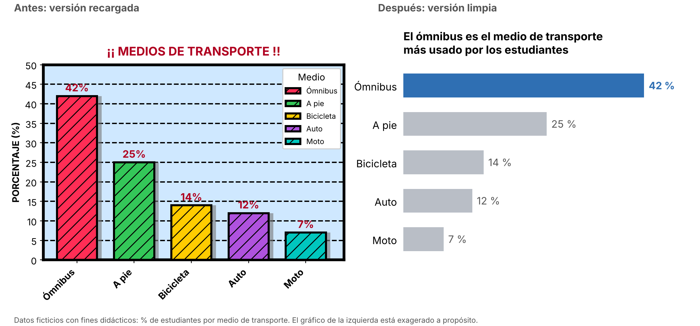
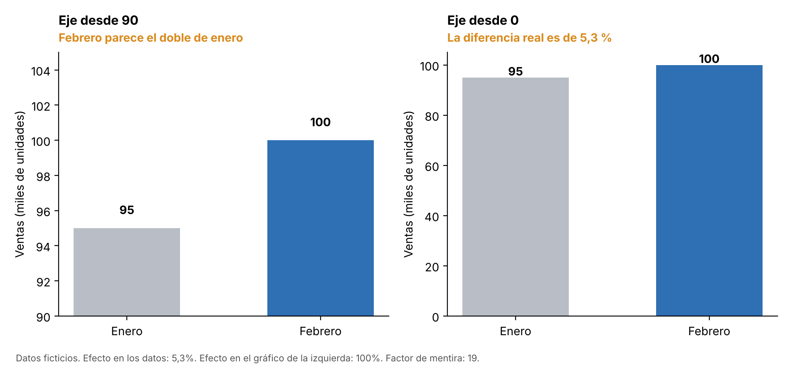
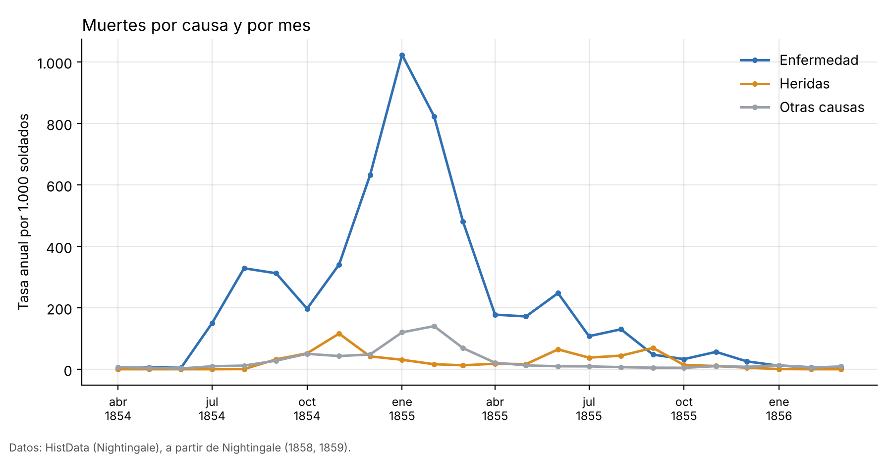
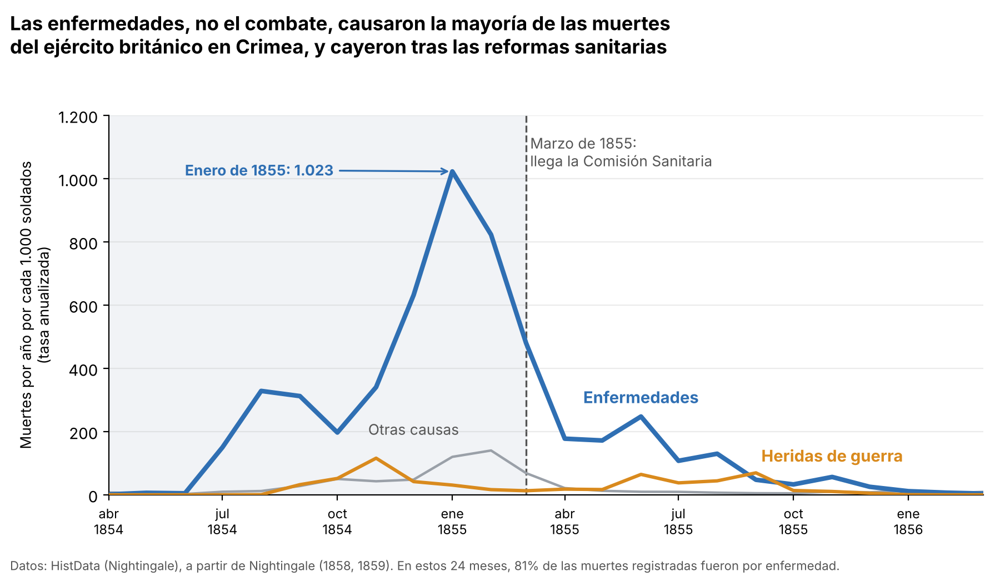

# Ver para entender

La cantidad de datos disponibles ha crecido de forma considerable. Empresas, universidades, gobiernos, aplicaciones y dispositivos generan información constantemente: ventas, temperaturas, calificaciones, ubicaciones, tiempos, edades, cantidades, preferencias y cientos de variables más.

Sin embargo, disponer de datos no significa necesariamente disponer de información útil.

Un conjunto de miles o millones de valores puede contener patrones importantes y, al mismo tiempo, resultar prácticamente imposible de interpretar si se observa únicamente como una tabla. La visualización de datos surge precisamente para abordar este problema: utilizar representaciones visuales que permitan explorar, analizar y comunicar información de manera efectiva.

Pero visualizar datos no consiste simplemente en transformar una tabla en un gráfico. Antes de elegir colores, ejes o tipos de gráfico existe una pregunta mucho más importante:

¿Qué queremos que el lector pueda comprender a partir de estos datos?

Esta pregunta será uno de los principios fundamentales de este libro.


## ¿Por qué visualizar datos?

Imagina que te entregan cuatro conjuntos de datos. Cada uno tiene 11 pares de valores, `x` e `y`, y tu trabajo es describirlos. Haces lo que haría cualquier persona prudente: calculas los números que resumen cada conjunto, como el promedio, la dispersión y la relación entre `x` e `y`.

El resultado es este:

| Conjunto | Media de x | Varianza de x | Media de y | Varianza de y | Correlación | Recta de regresión |
|:--:|--:|--:|--:|--:|--:|:--|
| I | 9 | 11 | 7,50 | 4,1 | 0,82 | y = 3,00 + 0,50x |
| II | 9 | 11 | 7,50 | 4,1 | 0,82 | y = 3,00 + 0,50x |
| III | 9 | 11 | 7,50 | 4,1 | 0,82 | y = 3,00 + 0,50x |
| IV | 9 | 11 | 7,50 | 4,1 | 0,82 | y = 3,00 + 0,50x |

: Resumen numérico de los cuatro conjuntos. Datos de @anscombe1973, cálculos con `python/anscombe.py`. Con más decimales aparecen diferencias de milésimas, sin importancia práctica. {#tbl-resumen}

Mira la tabla un momento. Los cuatro conjuntos tienen el mismo promedio, la misma dispersión, la misma correlación y hasta la misma recta. Con esta información, la conclusión razonable sería que los cuatro conjuntos son, en esencia, **el mismo**.

::: {.concepto}
**¿Qué significan esas columnas?**

- **Media:** el promedio de los valores.
- **Varianza:** mide cuánto se alejan los valores de su promedio. Si es pequeña, los valores están agrupados; si es grande, están dispersos.
- **Correlación:** un número entre -1 y 1 que indica qué tan bien se alinean los puntos en una recta. Cerca de 1, la recta sube; cerca de -1, baja; cerca de 0, no hay una recta que los resuma. Un valor de 0,82 indica una relación creciente bastante fuerte.
- **Recta de regresión:** la recta que mejor se ajusta a los puntos. La ecuación `y = 3,00 + 0,50x` dice que, en promedio, cada vez que `x` aumenta una unidad, `y` aumenta media unidad.
:::

### Ahora, dibujémoslos

Hagamos lo que la tabla no hace: poner cada punto en un gráfico.

{#fig-anscombe fig-alt="Cuatro gráficos de dispersión, uno por conjunto, con la misma recta de regresión. El conjunto I muestra puntos dispersos alrededor de la recta. El II describe una curva. El III forma una línea casi perfecta con un punto atípico arriba. El IV tiene diez puntos con el mismo valor de x y un único punto lejano a la derecha."}

Los números decían que eran iguales. Los gráficos (@fig-anscombe) cuentan cuatro historias muy distintas:

- **Conjunto I:** los puntos se reparten alrededor de una recta con algo de dispersión. Es el caso en que la recta resume bien lo que ocurre.
- **Conjunto II:** los puntos dibujan una curva. Existe una relación clara entre `x` e `y`, pero no es una recta, y la recta de regresión la describe mal.
- **Conjunto III:** casi todos los puntos forman una línea muy ordenada, salvo uno que se aleja del resto. Ese único punto "tira" de la recta. Sin él, la recta sería aproximadamente `y = 4,01 + 0,35x` y la correlación sería prácticamente 1.
- **Conjunto IV:** diez de los once puntos tienen exactamente el mismo valor de `x`. Un único punto, con `x = 19`, es el que determina toda la recta. Sin ese punto ni siquiera se podría calcular una recta, porque `x` no varía.

::: {.importante}
**Idea clave.** Un resumen numérico comprime muchos datos en unos pocos números, y al comprimir se pierde información. Conjuntos con historias muy distintas pueden producir exactamente el mismo resumen. El gráfico recupera lo que el resumen esconde: la forma de los datos.
:::

### Una idea cotidiana

Esto te puede sonar familiar. Dos estudiantes terminan el semestre con promedio 7. Una sacó 7, 7, 7 y 7 en sus cuatro pruebas. La otra sacó 10, 10, 4 y 4. El promedio es el mismo, pero la experiencia de cada una fue muy diferente. El promedio no miente, pero tampoco cuenta toda la historia.

### ¿Fue una casualidad?

Estos cuatro conjuntos no son datos reales: el estadístico Francis Anscombe los construyó a propósito en 1973 para mostrar este problema [@anscombe1973]. Su recomendación era hacer ambas cosas, los cálculos y los gráficos, y estudiar los dos resultados.

Décadas después, Justin Matejka y George Fitzmaurice fueron más lejos. Con un método computacional llamado *recocido simulado* (*simulated annealing*), que mueve los puntos poco a poco sin alterar las estadísticas, construyeron una familia de conjuntos de datos con la misma media, la misma desviación estándar y la misma correlación, pero con formas totalmente distintas. Uno de ellos dibuja un dinosaurio, y por eso el conjunto se conoce como el *Datasaurus Dozen* [@matejka2017].

Los casos extremos como estos son poco frecuentes en la práctica. Pero los problemas que ilustran (una relación curva, un punto atípico, un solo dato que domina el resultado) aparecen todo el tiempo en datos reales, y los números por sí solos no los delatan.

::: {.ejercicio}
**Pruébalo tú.**

1. Ejecuta `python python/anscombe.py` desde la raíz del repositorio. Verás la tabla de estadísticas calculada y se generará la figura.
2. En el archivo, cambia el valor `12.74` del conjunto III por `8.5` y vuelve a ejecutarlo. ¿Qué pasa con la recta y con la correlación? ¿Por qué?
3. Si solo hubieras tenido la tabla de este capítulo, ¿habrías podido saber que el conjunto III tiene un punto atípico?
:::

Entonces, visualizar datos no es un adorno que se agrega al final del análisis: es una herramienta para entender qué dicen realmente los datos. Pero, ¿qué es exactamente la visualización de datos? Lo vemos a continuación.

## ¿Qué es la visualización de datos?

En la sección anterior, los datos nunca cambiaron. Los números de la tabla y los puntos del gráfico eran exactamente la misma información. Lo único que cambió fue la forma de presentarla y, con eso, lo que pudimos entender.

Ese cambio de forma es justamente de lo que trata este libro.

### Una definición

En una frase sencilla: **visualizar datos es representar información de manera visual para que una persona pueda explorarla, entenderla y comunicarla.**

Una definición más precisa es la de la investigadora Tamara Munzner, que escribe (traducción propia):

> Los sistemas de visualización basados en computadora proveen representaciones visuales de conjuntos de datos, diseñadas para ayudar a las personas a realizar tareas de manera más efectiva. [@munzner2014]^[En el original: "Computer-based visualization systems provide visual representations of datasets designed to help people carry out tasks more effectively".]

Vale la pena leerla despacio, porque tiene tres partes:

1. **"Representaciones visuales"**: se usan formas, posiciones y colores, no solo números y palabras.
2. **"De conjuntos de datos"**: hay información real detrás de cada dibujo.
3. **"Diseñadas para ayudar a las personas a realizar tareas"**: esta es la más importante. Una visualización no se evalúa por lo bonita que sea, sino por si ayuda a alguien a hacer algo concreto con los datos.

Esa tercera parte conecta con la pregunta con la que abrimos el capítulo: *¿qué queremos que el lector pueda comprender?* La tarea del lector es lo que decide cómo se diseña el gráfico.

Munzner también señala que la visualización es adecuada cuando se busca ampliar las capacidades de las personas, y no reemplazarlas con métodos automáticos de decisión [@munzner2014]. Una forma de entenderlo: en una tabla tenemos que *leer* y *comparar* números uno por uno, y eso exige esfuerzo mental. En un gráfico, buena parte de ese trabajo lo hace la vista, que compara posiciones y longitudes de forma casi inmediata.

### La receta: de la tabla al gráfico

Todo gráfico se construye con la misma idea: **cada dato se convierte en algo que se puede ver**. Para entenderlo, primero necesitamos tres palabras.

::: {.concepto}
**Vocabulario básico**

- **Observación:** cada fila de una tabla. Es un caso: una persona, un día, una venta.
- **Variable:** cada columna de una tabla. Es una característica que se mide en cada caso: la edad, la temperatura, el precio.
- **Marca:** una forma geométrica básica con la que se dibuja una observación, como un punto, una línea o una barra.
- **Canal:** una propiedad que controla cómo se ve la marca, como su posición, su tamaño o su color [@munzner2014].
:::

Veámoslo con los datos de la sección anterior. Tomamos el conjunto I y lo dibujamos así:

{#fig-tabla-grafico fig-alt="A la izquierda, una tabla con 11 filas y dos columnas, x e y, con la fila x igual a 4 e y igual a 4,26 resaltada en naranja. A la derecha, un gráfico de dispersión con 11 puntos. Una flecha naranja une la fila resaltada con su punto, ubicado en x igual a 4 e y igual a 4,26."}

La @fig-tabla-grafico muestra lo que ocurre con una sola fila, la resaltada en naranja:

- La **observación** (la fila `x = 4`, `y = 4,26`) se dibuja como una **marca**: un punto.
- El valor de `x` se codifica con el **canal** de la posición horizontal.
- El valor de `y` se codifica con el **canal** de la posición vertical.

Repite eso con las once filas y obtienes el gráfico completo. Un gráfico de barras, uno de líneas o un mapa funcionan igual: cambian las marcas y los canales, pero la idea es la misma.

::: {.importante}
**Idea clave.** Visualizar es decidir qué marcas y qué canales usar para que cada variable se vea, y para que la persona que mira pueda hacer su tarea. Y una visualización no es mejor por ser más vistosa o más compleja, sino por ayudar a cumplir esa tarea.
:::

### ¿Para qué se visualizan los datos?

No siempre miramos un gráfico con el mismo objetivo. En este libro vamos a distinguir tres propósitos. Es una forma práctica de organizar el contenido, no una clasificación oficial.

| Propósito | La pregunta que responde | Ejemplo con lo que ya vimos |
|:--|:--|:--|
| **Explorar** | ¿Qué hay en estos datos? | Graficar los cuatro conjuntos para descubrir una curva y puntos que distorsionan la recta |
| **Analizar** | ¿Se sostiene este patrón o este modelo? | Comprobar si la recta de regresión describe bien cada conjunto |
| **Comunicar** | ¿Cómo hago que otra persona lo entienda? | Elegir la figura del cuarteto para explicar por qué conviene graficar |

: Tres propósitos de la visualización de datos. {#tbl-propositos}

El mismo conjunto de datos puede necesitar gráficos muy distintos según el propósito. Un gráfico para **explorar** puede ser rápido y desordenado, porque lo mira una sola persona que todavía está descubriendo. Uno para **comunicar** requiere más cuidado, porque lo mirará alguien que no estuvo en el análisis y que debe entenderlo sin ayuda.

### Qué cubre este libro

La visualización incluye muchos formatos: mapas, redes, diagramas, tableros, imágenes científicas. Para empezar, este libro se concentra en los **gráficos para datos organizados en tablas**, que son el punto de partida más sencillo y permiten aprender las ideas centrales. Esas ideas sirven después para los demás formatos.

::: {.ejercicio}
**Pruébalo tú.** Busca un gráfico en un diario, un informe o una página web, y responde:

1. ¿Qué variables muestra?
2. ¿Qué marcas usa (puntos, líneas, barras)?
3. ¿Qué canal codifica cada variable (posición, tamaño, color)?
4. ¿Su propósito es explorar, analizar o comunicar?
5. ¿Qué tarea quiere que haga el lector con él? ¿Lo logra?
:::

Si visualizar es ayudar a alguien a hacer una tarea, surge una pregunta incómoda: ¿qué pasa con todo lo que se agrega a un gráfico para que "se vea mejor"? Eso es lo que revisamos en la siguiente sección.

## Visualizar no es decorar

Al terminar la sección anterior quedó planteada una pregunta incómoda: si visualizar es ayudar a alguien a hacer una tarea, ¿qué pasa con todo lo que se agrega a un gráfico para que "se vea mejor"? ¿Ayuda o estorba?

La respuesta honesta tiene matices, y por eso esta sección sigue un orden: primero un caso concreto, luego las ideas de uno de los autores más influyentes del tema, después la evidencia que las pone a prueba y, por último, un criterio práctico para decidir.

### Dos gráficos, los mismos datos

Los dos gráficos de la @fig-recargado muestran exactamente la misma información: qué porcentaje de estudiantes usa cada medio de transporte.

{#fig-recargado fig-alt="A la izquierda, un gráfico de barras verticales muy recargado: fondo celeste, barras de colores distintos con rayado y sombra, bordes gruesos, rejilla negra punteada, leyenda y etiquetas inclinadas. A la derecha, un gráfico de barras horizontales ordenadas de mayor a menor, con la barra del ómnibus (42 %) en azul y las demás en gris, con el valor al final de cada barra y un título que dice que el ómnibus es el medio más usado."}

Haz una prueba rápida. Responde con cada gráfico: *¿qué medio de transporte es el más usado y cuánto más que el segundo?* Con los dos se puede responder, pero en el de la izquierda cuesta más, porque hay muchos elementos compitiendo con las barras. Esto es lo que cambió:

| En la versión recargada | El problema | En la versión limpia |
|:--|:--|:--|
| Un color distinto por barra | No agrega información: cada barra ya tiene su nombre | Un color de énfasis para lo importante y gris para el resto |
| Rayado, sombra y bordes gruesos | Compiten con la forma de la barra | Se eliminan |
| Fondo de color y rejilla pesada | Llaman más la atención que los datos | Se eliminan; el valor está escrito en cada barra |
| Leyenda | Repite lo que ya dice el eje | Se elimina |
| Etiquetas inclinadas | Cuestan más de leer | Barras horizontales con nombres legibles |
| Orden arbitrario | Obliga a comparar de a pares | Orden de mayor a menor |
| Título que solo nombra el tema | No dice qué debe concluir el lector | Título que enuncia el mensaje |

: Qué se cambió entre las dos versiones y por qué. {#tbl-recargado}

Fíjate en que no se tocó ningún dato. Lo único que se hizo fue decidir qué mostrar y qué dejar afuera.

### La mirada de Tufte: tinta de datos y *chartjunk*

El estadístico y diseñador Edward Tufte propuso en 1983 un lenguaje para hablar de esto en su libro *The Visual Display of Quantitative Information* [@tufte1983]. Tiene dos conceptos centrales.

**Tinta de datos y razón datos-tinta.** Imagina que imprimes el gráfico. La *tinta de datos* es la parte de la tinta que representa los datos: las barras, los puntos, las líneas. La **razón datos-tinta** compara esa parte con el total:

$$
\text{razón datos-tinta} = \frac{\text{tinta de datos}}{\text{tinta total del gráfico}}
$$

Si la razón es cercana a 1, casi toda la tinta muestra datos. Si es baja, hay mucha tinta que no aporta información.

**Chartjunk.** Es el término de Tufte (literalmente, "basura de gráficos") para los elementos que no son necesarios para comprender la información o que distraen de ella [@tufte1983]. En la versión recargada de la @fig-recargado, el rayado, la sombra y el fondo de color son ejemplos.

De ahí salen sus consejos principales, que se pueden resumir así: ante todo, mostrar los datos; aumentar la razón datos-tinta; y borrar tanto la tinta que no es de datos como la que es redundante, es decir, la que repite algo que ya está dicho [@tufte1983].

::: {.concepto}
**Tinta redundante.** Es la que muestra dos veces lo mismo. Un ejemplo es la leyenda del gráfico recargado: repite los nombres que ya figuran en el eje.
:::

**Una advertencia sobre el exceso de minimalismo.** Claus Wilke recuerda que la regla de Tufte lleva un matiz: maximizar la razón datos-tinta, *dentro de lo razonable*. Según Wilke, llevarla al extremo produce diseños que no son elegantes ni fáciles de descifrar, con elementos que "flotan" sin una referencia clara [@wilke2019]. Es decir, borrar los ejes, las unidades o los rótulos no mejora el gráfico: lo vuelve un acertijo. Por eso, en la versión limpia se conservaron los nombres de las categorías y los valores.

### ¿Toda decoración es mala? Lo que dice la evidencia

Las ideas de Tufte son principios de diseño, no resultados de un experimento. Para ponerlas a prueba, Bateman y sus colegas compararon gráficos con ilustraciones elaboradas, al estilo del diseñador Nigel Holmes, con versiones sencillas de los mismos datos [@bateman2010]. Participaron 20 personas y se usaron 14 pares de gráficos. Esto encontraron:

| Medida | Resultado |
|:--|:--|
| Interpretación inmediata del gráfico | La precisión con los gráficos ilustrados no fue peor que con los sencillos |
| Recuerdo a los 5 minutos | Sin diferencias significativas |
| Recuerdo a las 2 o 3 semanas | Significativamente mejor con los gráficos ilustrados |
| Preferencia de las personas | Mayoría clara a favor de los gráficos ilustrados |

: Resultados principales de @bateman2010. {#tbl-bateman}

**¿Qué hacemos con esto?** Conviene leerlo con cuidado:

- Es **un estudio pequeño** (20 personas), con un tipo particular de ilustración: imágenes elaboradas que envolvían los datos, hechas por un diseñador profesional. No es lo mismo que un fondo de color y un rayado puestos al azar, como en nuestra versión recargada.
- Aun así, **matiza la idea de que toda decoración perjudica**. Al menos en ese estudio, no empeoró la comprensión y mejoró el recuerdo a largo plazo.
- Una hipótesis razonable, aunque este estudio no la prueba, es que importa para qué se hace el gráfico: si lo que se necesita es leer valores con precisión, el exceso de elementos cuesta; si lo que se busca es que el mensaje se recuerde, una ilustración bien pensada podría ayudar.

La conclusión es que la pregunta útil no es "¿tiene adornos este gráfico?", sino **"¿qué efecto tiene cada elemento en lo que el lector debe hacer?"**.

### Cuando el diseño distorsiona: el factor de mentira

Hay una decisión de diseño que no es cuestión de gusto, porque cambia lo que los datos dicen. Tufte lo formuló como un principio: el valor de un atributo visual (la longitud de una barra, por ejemplo) debe ser directamente proporcional al valor del dato. Para medirlo propuso el **factor de mentira** [@tufte1983]:

$$
\text{factor de mentira} = \frac{\text{tamaño del efecto mostrado en el gráfico}}{\text{tamaño del efecto en los datos}}
$$

Un factor de 1 significa que el gráfico es fiel. Un valor mucho mayor que 1 indica que exagera una diferencia, y uno menor que 1 que la minimiza.

Veamos un caso. Las ventas pasaron de 95 mil unidades en enero a 100 mil en febrero (datos ficticios). En la @fig-eje, el gráfico de la izquierda corta el eje en 90.

{#fig-eje fig-alt="Dos gráficos de barras con las ventas de enero (95) y febrero (100). A la izquierda, el eje vertical empieza en 90 y la barra de febrero parece el doble de alta que la de enero. A la derecha, el eje empieza en 0 y las dos barras son casi iguales."}

Haz las cuentas:

- **Efecto en los datos:** $(100 - 95) / 95 \approx 5{,}3\,\%$.
- **Efecto en el gráfico de la izquierda:** la barra de enero mide 5 unidades de alto (95 - 90) y la de febrero 10 (100 - 90), así que febrero parece un $100\,\%$ mayor.
- **Factor de mentira:** $100\,\% / 5{,}3\,\% \approx 19$.

El gráfico de la izquierda exagera la diferencia unas 19 veces. Ninguna ilustración ni adorno lo provoca: basta con dónde empieza el eje. En un gráfico de barras, lo que se lee es la **longitud**, y por eso el eje debe partir de cero. Con otras marcas, como los puntos, el criterio puede ser distinto.

### Un criterio práctico: la prueba de la tarea

Todo lo anterior se puede resumir en una prueba que puedes aplicar a cualquier gráfico, elemento por elemento. Para cada uno, pregunta:

| Pregunta | Si la respuesta es sí... |
|:--|:--|
| ¿Muestra datos, o ayuda a leerlos (ejes, unidades, rótulos)? | **Mantenerlo** |
| ¿Repite algo que ya está en el gráfico? | **Quitarlo**, o justificar por qué se queda |
| ¿Compite con los datos por la atención (color, textura, tamaño)? | **Atenuarlo** |
| ¿Cambia la proporción entre lo que se ve y lo que dicen los datos? | **Corregirlo** (revisa el factor de mentira) |

: La prueba de la tarea, aplicada a cada elemento de un gráfico. {#tbl-prueba}

::: {.importante}
**Idea clave.** La pregunta no es si un gráfico tiene adornos, sino si cada elemento ayuda al lector a hacer su tarea. Quitar lo que no aporta suele mejorar un gráfico, pero borrarlo todo lo empeora. Y nada de lo que se haga con el diseño debe cambiar lo que dicen los datos.
:::

::: {.ejercicio}
**Pruébalo tú.** Retoma el gráfico que elegiste en el ejercicio de la sección anterior y aplícale la prueba de la @tbl-prueba:

1. Anota tres elementos que quitarías o atenuarías, y explica por qué.
2. Anota un elemento que agregarías para que se lea mejor (una unidad, un rótulo, un título que diga el mensaje).
3. Si es un gráfico de barras, ¿el eje parte de cero? Si no, calcula su factor de mentira.
:::

Hasta aquí hablamos de qué mostrar y qué dejar afuera. Falta la pregunta de fondo: ¿qué queremos que el lector se lleve después de mirar el gráfico? Eso nos lleva a pasar de los datos a una historia.

## De los datos a una historia

Hasta aquí aprendimos a mirar datos, a dibujarlos y a quitar lo que sobra. Falta el paso que convierte un gráfico correcto en un gráfico que *dice algo*. Un gráfico puede estar bien hecho y aun así dejar al lector preguntándose: "¿y qué?". Esta sección trata de cómo evitar ese "¿y qué?".

### Un caso histórico: Florence Nightingale en la Guerra de Crimea

Durante la Guerra de Crimea (1854 a 1856) murieron muchísimos soldados británicos. La pregunta de fondo era por qué, y qué se podía hacer al respecto. Florence Nightingale, hoy recordada sobre todo como enfermera y reformadora social, sostenía que los datos estadísticos, presentados en gráficos y diagramas, podían ser argumentos poderosos a favor de reformas médicas [@histdata].

Con las cifras que ella publicó [@nightingale1858; @nightingale1859], en la versión digitalizada del paquete HistData [@histdata], tenemos la mortalidad mensual del ejército británico durante 24 meses, de abril de 1854 a marzo de 1856. Como el ejército cambió de tamaño, no se comparan muertes sueltas sino una **tasa anualizada**: cuántas muertes por cada 1.000 soldados habría en un año si el ritmo de ese mes se mantuviera todo el año.

::: {.concepto}
**Tasa anualizada.** Es como la velocidad de un auto. Si manejaste solo 10 minutos y dices "voy a 60 km/h", no recorriste 60 km: dices cuánto recorrerías en una hora si siguieras al mismo ritmo. Con las muertes pasa igual: se expresa el ritmo de un mes como si durara un año, para poder comparar meses distintos.
:::

Empecemos por la versión para **explorar**, la que haríamos al abrir los datos por primera vez:

{#fig-nightingale-exploratoria fig-alt="Gráfico de líneas con tres series mensuales de abril de 1854 a marzo de 1856. La línea de enfermedad sube hasta superar 1.000 en enero de 1855 y luego baja. Las líneas de heridas y de otras causas se mantienen mucho más bajas. Hay una leyenda y el título dice solo muertes por causa y por mes."}

La @fig-nightingale-exploratoria es correcta y muestra todo. Sirve para quien investiga y todavía no sabe qué buscar. Pero si se la mostramos a alguien que tiene que decidir algo, le deja todo el trabajo: tendrá que descubrir por su cuenta cuál línea importa, qué pasó en enero de 1855 y qué debería hacerse con eso.

Ahora, **los mismos datos**, con un mensaje:

{#fig-nightingale-explicativa fig-alt="Gráfico de líneas con las mismas series. La línea de enfermedad es azul y gruesa, la de heridas es naranja y la de otras causas es gris. Una línea vertical punteada marca marzo de 1855, cuando llega la Comisión Sanitaria, y una nota indica el máximo de enero de 1855 con 1.023. El título afirma que las enfermedades causaron la mayoría de las muertes y que cayeron tras las reformas sanitarias."}

No cambió ni un dato. Lo que cambió fueron decisiones de diseño al servicio de un mensaje:

1. **Un titular que afirma algo.** "Muertes por causa y por mes" solo nombra el tema; el nuevo titular dice qué debe concluir el lector.
2. **Énfasis.** Color y grosor para la línea que importa, y gris para lo secundario.
3. **Etiquetas directas.** Los nombres están junto a las líneas, así que no hace falta una leyenda.
4. **Anotaciones.** Señalan los dos hechos clave: el máximo de enero de 1855 y la llegada de la Comisión Sanitaria en marzo de ese año.
5. **Contexto.** El sombreado separa el período anterior a la reforma del posterior.
6. **Fuente y medida.** El pie aclara de dónde vienen los datos y qué se mide.

Y detrás del titular hay números que lo respaldan:

| Período | Muertes por enfermedad | Muertes por heridas | Muertes por enfermedad por cada muerte por heridas | Tasa anual media por enfermedad (por 1.000 soldados) |
|:--|--:|--:|--:|--:|
| Abril 1854 a marzo 1855 (antes de la reforma) | 11.157 | 772 | 14,5 | 398 |
| Abril 1855 a marzo 1856 (después) | 3.319 | 986 | 3,4 | 79 |

: Las cifras detrás del mensaje. Cálculos propios con `data/raw/nightingale.csv` (`python/historia.py`), a partir de @histdata. Las "enfermedades" son las prevenibles o mitigables, según la clasificación del conjunto de datos. {#tbl-nightingale}

En el primer año murieron 14,5 soldados por enfermedad por cada uno por heridas. En el segundo, 3,4. Y la tasa anual media de muertes por enfermedad fue unas cinco veces menor.

### Del dato al mensaje: la escalera

Piensa en subir una escalera. En el escalón de abajo están los datos sueltos y, a medida que subes, empiezan a significar algo:

| Escalón | Qué es | Ejemplo con los datos de Nightingale |
|:--|:--|:--|
| **1. Dato** | Una cifra suelta | En enero de 1855 murieron 2.761 soldados por enfermedad |
| **2. Patrón** | Lo que aparece al mirar muchos datos juntos | Las muertes por enfermedad aumentan hasta enero de 1855 y después bajan |
| **3. Mensaje** | Lo que importa y lo que el lector debería concluir | La enfermedad, y no el combate, fue el principal problema, y bajó después de las reformas |
| **4. Acción** | Lo que el lector podría hacer con eso | Apoyar y ampliar las reformas sanitarias |

: La escalera de los datos al mensaje. Es un esquema de este libro para organizar la idea, no un modelo tomado de una fuente. {#tbl-escalera}

Un gráfico para **comunicar** apunta al escalón 3 o al 4. Uno para **explorar** suele quedarse en el 1 o el 2, y eso está bien: depende del propósito que vimos en la sección 1.2.

### Cómo se cuenta una historia con datos

Contar historias con gráficos no es solo una intuición: se ha estudiado. Los investigadores Segel y Heer revisaron, desde casos de la prensa hasta trabajos de investigación, cómo se construyen las "historias de datos" y encontraron que se diferencian de la narración tradicional en aspectos importantes [@segel2010]. Identificaron siete **géneros** de visualización narrativa:

1. Estilo revista (*magazine style*)
2. Gráfico anotado (*annotated chart*)
3. Póster dividido (*partitioned poster*)
4. Diagrama de flujo (*flow chart*)
5. Tira cómica (*comic strip*)
6. Presentación de diapositivas (*slide show*)
7. Película, video o animación (*film/video/animation*)

Nuestra versión explicativa de Nightingale es un ejemplo del género 2, el **gráfico anotado**: un solo gráfico al que se le agregan titular y notas para guiar la lectura.

Los autores también describen los diseños según el equilibrio entre dos cosas: el recorrido que **el autor** quiere imponer y la **exploración libre del lector**, que suele ocurrir con elementos interactivos [@segel2010]. Una de las estructuras que proponen se llama *martini glass* (copa de martini): empieza con una parte guiada por el autor, con preguntas, observaciones o un texto que presentan el gráfico, y cuando termina el relato se abre a una parte en la que el lector explora los datos por su cuenta [@segel2010]. Imagina la copa: un tallo angosto, donde alguien te lleva de la mano, y luego una boca amplia, donde ya puedes moverte libre.

Esto conecta con los propósitos de la sección 1.2. Primero se **comunica** un mensaje y después se deja **explorar**.

Segel y Heer agrupan además las tácticas de diseño en dos familias: las **visuales** (estructura visual, resaltado y guía de las transiciones) y las de **estructura narrativa** (orden, interactividad y mensajes) [@segel2010]. En nuestro gráfico de Nightingale usamos sobre todo el *resaltado* (color y grosor) y los *mensajes* (titular y anotaciones).

### Contar sin engañar

Una historia convincente no es necesariamente una historia verdadera. El énfasis es poderoso, y por eso exige responsabilidad. Antes de publicar un gráfico explicativo, conviene hacerle estas preguntas:

| Pregunta | Cómo se aplicó al gráfico de Nightingale |
|:--|:--|
| ¿El titular dice solo lo que los datos sostienen? | Dice que las enfermedades "cayeron **tras** las reformas", no "**por culpa** de" ni "**gracias a**" ellas. Los datos muestran que la caída vino después, pero una comparación de antes y después no demuestra por sí sola que la reforma la causó: durante una guerra cambian muchas cosas a la vez. |
| ¿Se muestra la medida y su unidad? | Se aclara que es una tasa anualizada por cada 1.000 soldados. |
| ¿Se dejó afuera algo que contradice el mensaje? | No. Las heridas se muestran, y el mensaje vale para el total, no para cada mes: en septiembre de 1855 hubo más muertes por heridas (276) que por enfermedad (189). |
| ¿El diseño mantiene la proporción de los datos? | Sí: el eje parte de cero (ver sección 1.3). |

: Preguntas de honestidad para un gráfico explicativo. {#tbl-honestidad}

::: {.importante}
**Idea clave.** Un gráfico explicativo es una afirmación apoyada en datos. Tu trabajo es elegir qué afirmación hacer, decirla con claridad (titular, énfasis, anotaciones) y asegurarte de que los datos realmente la sostienen.
:::

::: {.ejercicio}
**Pruébalo tú.**

1. Escribe en una frase el mensaje de la @fig-anscombe (el cuarteto de Anscombe), como si fuera el titular de un gráfico.
2. Retoma el gráfico que elegiste en la sección 1.2. ¿En qué escalón de la @tbl-escalera se queda? Reescribe su titular para que llegue al escalón 3.
3. Escribe un titular para la versión de Nightingale que afirme **más** de lo que los datos permiten. ¿Qué pregunta de la @tbl-honestidad no pasaría?
:::

Con esto cerramos las ideas centrales del capítulo. Antes de seguir, conviene saber qué vas a encontrar a lo largo del libro.

## ¿Qué aprenderás en este libro?

Este libro responde, paso a paso, una pregunta: **¿cómo logro que un gráfico ayude a alguien a entender los datos?** No necesitas conocimientos previos de estadística ni de programación. Los conceptos se explican en el momento en que aparecen.

### Un mapa del libro

El libro tiene dos partes. La primera enseña a **ver y pensar** los datos. La segunda enseña a **elegir y construir** gráficos.

| Parte | Capítulo | Pregunta que responde | Estado |
|:--|:--|:--|:--|
| I. Fundamentos | 1. Ver para entender | ¿Por qué y para qué visualizamos datos? | Borrador 0.1 |
| | 2. Tipos de datos | ¿Con qué clase de datos trabajamos y qué cambia según su tipo? | En preparación |
| II. Gráficos | 3. Elegir un gráfico | ¿Qué gráfico conviene según lo que quiero mostrar? | En preparación |
| | 4. Comparación | ¿Cómo se comparan valores y grupos? | En preparación |

: Mapa del libro. Los capítulos 2 a 4 están en preparación y sus títulos son provisionales. {#tbl-mapa}

### Qué podrás hacer al terminar este capítulo

Cada sección de este capítulo te deja una capacidad concreta:

- **Sección 1.1:** explicar por qué un resumen numérico no basta para entender unos datos, y reconocer el cuarteto de Anscombe como el ejemplo clásico.
- **Sección 1.2:** definir qué es visualizar datos, e identificar las marcas y los canales de cualquier gráfico.
- **Sección 1.3:** decidir qué conservar y qué quitar de un gráfico con la prueba de la tarea, y calcular el factor de mentira de un gráfico de barras.
- **Sección 1.4:** convertir un gráfico para explorar en uno para comunicar, con un titular que afirme algo y que los datos realmente sostengan.

### Qué no encontrarás

- **Un manual de una herramienta.** Las ideas valen para cualquier programa. El código en Python que acompaña al libro sirve como ejemplo, no como curso de programación.
- **Mapas, redes ni imágenes científicas.** Como vimos en la sección 1.2, el libro se concentra en gráficos para datos organizados en tablas.
- **Un reemplazo de la estadística.** Los gráficos y los cálculos se complementan, como mostró el cuarteto de Anscombe.

### Para quién es

Para cualquier persona que quiera entender y comunicar mejor con datos: estudiantes, profesionales de cualquier área, o simplemente lectores curiosos. Si sabes qué es una tabla y qué es un promedio, tienes todo lo necesario.


## Cómo utilizar este libro

### Tres formas de leerlo

- **De corrido.** Es el camino recomendado la primera vez: cada sección se apoya en la anterior.
- **Como consulta.** Si ya conoces las ideas básicas, puedes ir directo a la sección que necesites. Las referencias cruzadas ("ver la sección 1.3") te indican de dónde viene cada idea.
- **Con las manos.** Los ejercicios y el código de cada capítulo están pensados para que practiques. Aprender a ver gráficos requiere mirar muchos.

### Las cajas de colores

A lo largo del libro verás tres tipos de caja:

::: {.concepto}
**Concepto.** Una definición o una idea que necesitas para seguir. Si ya la conoces, puedes saltarla.
:::

::: {.importante}
**Idea clave.** El mensaje central de una sección, para que te lo lleves aunque lo demás se te olvide.
:::

::: {.ejercicio}
**Pruébalo tú.** Una actividad para practicar lo aprendido. En esta versión del libro no se incluyen las respuestas.
:::

### Figuras, tablas y citas

- Las figuras y las tablas se numeran solas y se mencionan en el texto, por ejemplo la @fig-anscombe. Todas las figuras tienen una descripción alternativa para quienes no pueden verlas.
- Cuando una figura usa **datos ficticios**, el pie lo dice. Si los datos son reales, se indica la fuente.
- Las afirmaciones apoyadas en la literatura llevan una cita entre paréntesis, como (Munzner 2014), y la referencia completa está en **Referencias**, al final del libro. Cuando el original está en inglés y se cita una frase, se aclara que la traducción es propia.
- Te animamos a que verifiques las fuentes importantes por tu cuenta. Cuando una fuente tiene DOI, el enlace lleva directamente al texto original.

### El código y los datos

El libro vive en un repositorio de GitHub. Dentro de él, cada carpeta tiene una función:

| Carpeta | Qué contiene |
|:--|:--|
| `capitulos/` | El texto del libro |
| `python/` | Los programas que generan las figuras |
| `data/` | Los datos usados en los ejemplos |
| `images/` | Las figuras ya generadas |

: Carpetas del repositorio. {#tbl-carpetas}

Para reproducir las figuras necesitas Python 3. Desde la carpeta principal del repositorio, ejecuta:

```bash
python -m pip install -r requirements.txt
python python/anscombe.py
```

El primer comando instala las librerías necesarias (una sola vez). El segundo calcula las estadísticas del cuarteto de Anscombe y genera su figura. Cada programa indica en sus primeras líneas qué hace y de dónde provienen sus datos.

### Convenciones

- En el texto, los decimales se escriben con coma (4,26). En el código, con punto (4.26), como exige Python.
- Los nombres de variables, archivos y comandos aparecen en `tipografía de código`.
- Los términos en inglés se escriben en cursiva la primera vez, junto a su traducción, porque la mayoría de la literatura está en ese idioma.

### Un libro en construcción

Esta es la versión 0.1: un borrador abierto que se mejora con el tiempo. Si encuentras un error o tienes una sugerencia, puedes avisar abriendo un *issue* en el repositorio. Una buena corrección es una forma de colaborar con el libro.

En el siguiente capítulo empezamos con los ladrillos de todo gráfico: los datos.
